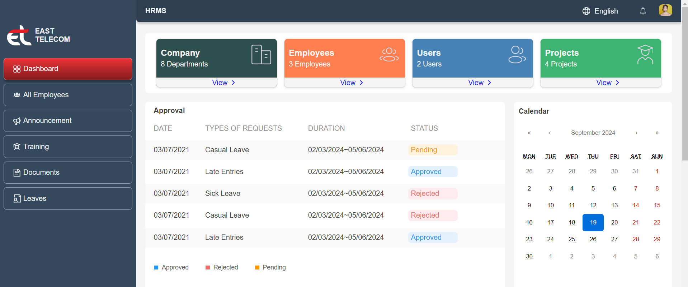
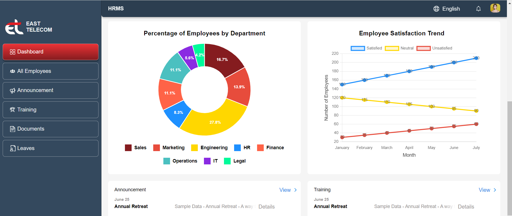
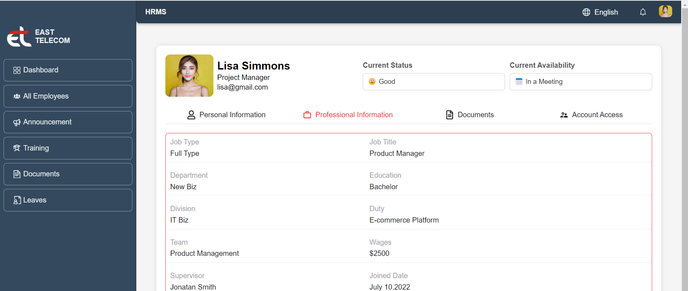

#   HRMS (Human Resource Management System)

## Overview

HRMS is a comprehensive Human Resource Management System designed to streamline HR processes and enhance employee management. Built with a modern tech stack, the project utilizes **React** for the frontend and **Python** for the backend, ensuring a robust and scalable solution.

## Table of Contents

- [Features](#features)
- [Tech Stack](#tech-stack)
- [Installation](#installation)
- [Usage](#usage)
- [Screenshots](#screenshots)
- [Contributing](#contributing)
- [License](#license)
- [Contact](#contact)

## Features

- **Fast Information Exchange**: Efficiently handle and share critical HR information.
- **Comprehensive Employee Data**: Access and manage detailed information for each employee.
- **User-Friendly Interface**: Intuitive design ensures ease of use for all users.
- **CRUD Operations**: Full Create, Read, Update, and Delete functionality for managing HR data.
- **Organizational Structure Management**: Easily configure and visualize the organizational hierarchy.
- **Multi-language Support**: Available in multiple languages to cater to a global audience.
- **Simplicity & Efficiency**: Simplified workflows that boost productivity.

## Tech Stack

### Frontend

- **React**: A JavaScript library for building user interfaces.
- **Vite**: A fast build tool for modern web development.
- **CSS/SCSS**: Styling the UI components.

### Backend

- **Python**: A versatile programming language for backend development.
- **Django**: A high-level Python web framework for rapid development.

## Installation

### Prerequisites

- **Node.js**: Ensure you have Node.js installed.
- **Python**: Version 3.8 or above is required.
- **Git**: For version control.

### Setup

1. **Clone the repository**:
   ```bash
   git clone https://github.com/yourusername/hrms.git```

2. **Navigate to the project directory:**
   ```bash
   cd hrms```
   
4. **Install dependencies**:
   ```bash
   cd frontend
   npm install```
   
### Running the Application
- **Frontend**:
   ```bash
   npm run dev```

## Usage

Once both servers are running, you can access the application at http://localhost:3000. Navigate through the HRMS platform to explore its features.


## Screenshots
<p align="center">
  
  
  
</p>

